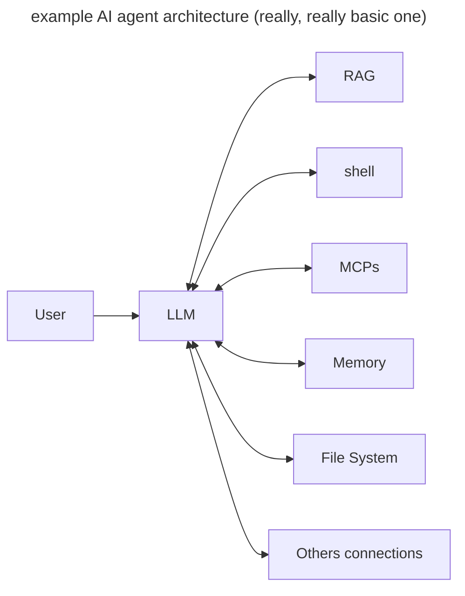

# The importance of sandboxing and access control in AI agents

I started exploring ways to isolate AI agents execution and handle access control when working for my last employer. 
This problem came back when I started developing my own AI agent for pentesting ([called deadend-cli](https://github.com/gemini-15/deadend-cli) for when you find yourself stuck) where I needed to run Python code and give access to a shell terminal safely (especially when using pentesting tools, it really doesn't look very safe...)
Furthermore, there have been numerous AI agents failing, and in some cases getting exploited, due to a lack of sandboxing and access control.
We can recall:
- Langflow exploit
- Database wipe-out 

## Why, what and how?

Before talking about sandboxing, it might be good to understand what we want to secure.
In Agentic AI, we have multiple systems that can go together. A schema that we usually have is the following : 

If we do a quick threat modelling, we can see that the most interesting attack vectors are coming from what the model contacts.

In the last few months multiple AI agents vulnerabilities (and critical bugs leading to failure... like a database wipe-out - hey [replit](https://cybernews.com/ai-news/replit-ai-vive-code-rogue/) 👋), but also other interesting ones that lead to an RCE :
- The langflow RCE discovered by [Horizon3](https://horizon3.ai/attack-research/disclosures/unsafe-at-any-speed-abusing-python-exec-for-unauth-rce-in-langflow-ai/). 
- Cursor vulnerability that leads to an RCE through [auto-execution](https://www.aim.security/post/when-public-prompts-turn-into-local-shells-rce-in-cursor-via-mcp-auto-start). 
- The famous database wipe-out. 
- And sadly, maybe others to come.

> Sandboxing and access control is pointed to as one of the OWASP top 10 AI agents threats in [AAI002: Agent Tool Interaction Manipulation](https://github.com/precize/Agentic-AI-Top10-Vulnerability/blob/main/agent-critical-systems-02.md) for more insight. 

### Basic AI agent tooling

Running arbitrary code is never a good idea (unsurprisingly). But sometimes we need to. In the case of Agentic AI, it became clear that running code will be necessary to build workflows with self-evaluation and feedback.
But it's not just about dealing with running arbitrary code, it's also about how to secure interactions with the *filesystem*, *network*, and *other applications*.

The unpredictability of LLMs makes it difficult to resolve the issue solely by using safety measures. For example, we can try to detect if a malicious code is about to be ran before doing so using classifiers, rules or even another LLM call, and that could indeed suppress 95% of threats and cases (Just throwing numbers here, I don't have real stats. I'll update this when I find some...). The problem is, security is about being sure that the system is 100% secure, 100% of the time. 

### MCP case

MCPs are designed to be used locally first. Other tools, such as MCP-remote makes usable through a gateway which gives it the capability to use MCP servers remotely. 
  
In the MCP docs we find this note : 
> **Security considerations**: Both clients and servers must handle sensitive data appropriately during sampling. Clients should implement rate limiting and validate all message content. The human-in-the-loop design ensures that server-initiated AI interactions cannot compromise security or access sensitive data without explicit user consent.

MCP servers are subject to different attacks. They can have access to the filesystem, databases and other types of resources. So why don't we have more runtime isolation in there ***(legitimate question, why don't we implement sandboxing and least privilege principle here by default?)***

## Current security measures implemented

I've talked in my last article about the numerous attacks on LLMs including the ones related to prompt injection.

Most of the work that is done to counter these attacks is focused on guardrails, classifiers and scanners. Supposedly, this should resolve most of the issues.
However the question is: *Is it better to spend time looking at each user input to see if it is malicious or be able to run anything in a secure environment that doesn't affect the end-user ?*

 ## Looking ahead 

AI agents and MCP developments will evolve and new use-cases will be developed. 
There are promising elements in MCP’s security design—such as supply chain protection and best practices—but history suggests they will eventually be exploited, just as early web applications were.
So it might be more than crucial (maybe ? surely ?) to add some mechanisms that protect your data and environment even if it gets exploited. There are some interesting projects going on now that are trying to solve this predicament. 
- [Container-use](https://github.com/dagger/container-use) for example, is made by the guys behind docker. 
- Others, are trying to make a complete OS for AI agents (go figure, the biggest claims are the most well received these days). 
- There is also normal sandboxing from e2b and daytona and others. 
The market is growing but not mature enough, because each use-case is different. I've decided to do it myself in my project, because I wanted something that suited my needs and didn't depend on a specific environment, and also that most people are using the same principles (docker or MicroVMs or Webassembly), so the actual security protections is not changed (Do we really need a whole cloud infrastructure to run print(1+1) AI generated code in Python?).  
## references

- *Unsafe at Any Speed: Abusing Python Exec for Unauth RCE in Langflow AI* - Naveen Sunkavally : [https://horizon3.ai/attack-research/disclosures/unsafe-at-any-speed-abusing-python-exec-for-unauth-rce-in-langflow-ai/](https://horizon3.ai/attack-research/disclosures/unsafe-at-any-speed-abusing-python-exec-for-unauth-rce-in-langflow-ai/)